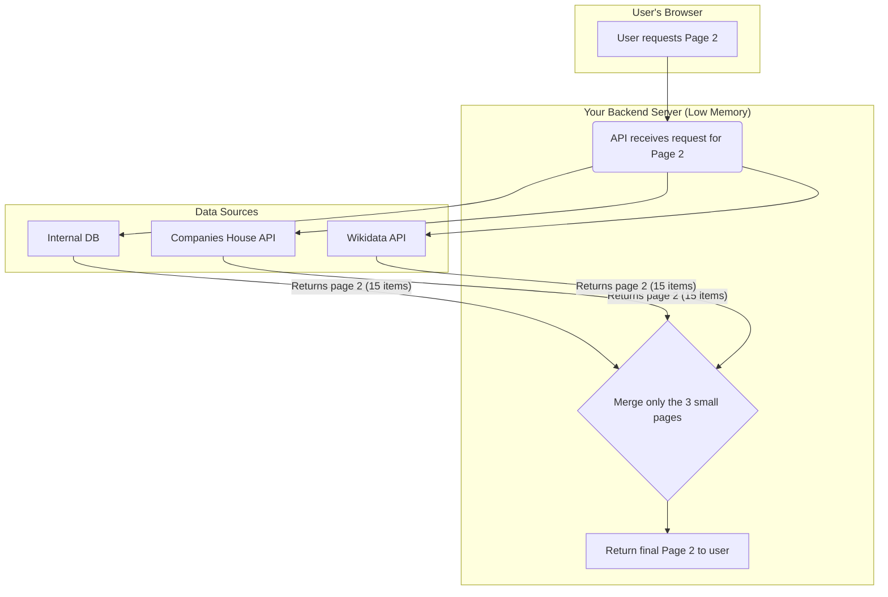

# Backend Memory Flow for Pagination

This diagram illustrates how the backend processes pagination requests efficiently, without loading the entire result set into memory.

## The Core Principle: Never Load Everything into Memory

The fundamental mistake in the old logic was that it tried to fetch all possible results, load them into the backend's memory, and then perform operations. The architecture we have now is built on the opposite principle: the backend only ever holds the data for the single page the user is currently looking at. 

Here is a diagram illustrating the memory-efficient flow we have now:

## Visual Representation of Backend Memory Flow

## How it Respects Best Practices

- **Backend-Driven Pagination (Correct):** The backend is responsible for fetching and preparing exactly one page of data. The frontend is simple—it just says "give me page 2" or "give me page 3." This is the standard for all major scalable applications (Google, Facebook, etc.).

- **Stateless Processing:** Each API request is self-contained. The server doesn't need to remember the user's entire search result set between requests. When you ask for page 3, it fetches page 3. It doesn't need to know anything about pages 1 or 2. This is highly memory-efficient and easy to scale horizontally (by adding more server instances).

- **Efficient Database Queries:** We are now using `.range(from, to)` in our internal database query. This command tells the database "do the hard work of finding the correct 15 items and only send me those." The database is optimized for this, and it prevents our backend from being flooded with thousands of results it doesn't need.

- **Minimal In-Memory Footprint:** At any given moment, for any given user request, the maximum number of items our backend has to think about is (15 from DB) + (15 from Companies House) + (15 from Wikidata). It merges this small set, ranks it, and sends the final ~15 results to the user. The memory used is tiny and, crucially, constant. It doesn't matter if the total result set is 10,000 or 10 million; the memory used by the backend to serve one page request remains the same.

In short, the architecture is now robust, scalable, and memory-efficient. You asked exactly the right question, which led us to fix a critical architectural flaw.
