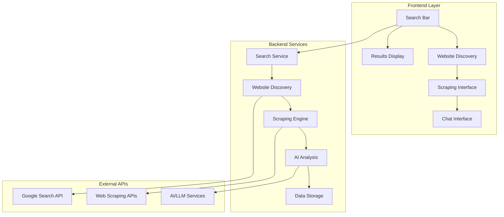

# Search-Scraper Intelligence Platform Plan

## 🎯 Vision Statement
Transform Sikry from a search engine into a comprehensive web intelligence platform that can intelligently discover, analyze, and extract data from any website through natural language interaction.

## 🔄 Current State → Target State

### Current State
- ✅ Natural language search across multiple data sources
- ✅ Pagination and caching system
- ✅ Company profile display
- ✅ Basic data extraction from structured sources

### Target State
- 🚀 **Intelligent Website Discovery**: Auto-find and suggest relevant websites
- 🚀 **Smart Scraping Engine**: Extract data from any website using AI
- 🚀 **Interactive Data Extraction**: Chat-based data extraction requests
- 🚀 **Unified Intelligence Hub**: Combine search + scraping + analysis

---

## 🏗️ Architecture Overview



---

## 🎯 Core User Flows

### Flow 1: Intelligent Website Discovery
```
User types: "tripadvisor"
↓
System: 
1. Searches for "tripadvisor" across data sources
2. Performs Google search for "tripadvisor official website"
3. Returns: "Found tripadvisor.com - Click to analyze"
↓
User clicks → Opens scraping interface
```

### Flow 2: Manual URL Input
```
User types: "I want to analyze this website: [pastes URL]"
↓
System:
1. Validates URL
2. Performs initial scan
3. Shows: "I can extract: Company info, Contact details, Services, etc."
4. Offers: "What specific data do you need?"
```

### Flow 3: Chat-Based Extraction
```
User: "Get all email addresses from this site"
↓
System:
1. Analyzes request
2. Scrapes website
3. Extracts emails
4. Returns: "Found 5 email addresses: [list]"
```

---

## 🛠️ Technical Implementation

### 1. Website Discovery Service
**Location**: `app/api/discover/route.ts`

```typescript
interface DiscoveryRequest {
  query: string;
  type: 'company' | 'website' | 'service';
}

interface DiscoveryResponse {
  websites: WebsiteSuggestion[];
  confidence: number;
  searchQuery: string;
}

interface WebsiteSuggestion {
  url: string;
  title: string;
  description: string;
  relevance: number;
  dataAvailable: string[];
}
```

**Implementation Strategy**:
- Use Google Custom Search API for website discovery
- Integrate with existing search adapters
- Cache discovery results
- Provide relevance scoring

### 2. Intelligent Scraping Engine
**Location**: `app/api/scrape/route.ts`

```typescript
interface ScrapeRequest {
  url: string;
  extractionType: 'auto' | 'custom';
  customFields?: string[];
  aiPrompt?: string;
}

interface ScrapeResponse {
  extractedData: ExtractedData;
  confidence: number;
  fieldsFound: string[];
  suggestions: string[];
}

interface ExtractedData {
  companyName?: string;
  description?: string;
  location?: string;
  address?: string;
  emails: string[];
  phones: string[];
  services?: string[];
  technologies?: string[];
  socialMedia?: Record<string, string>;
}
```

**Implementation Strategy**:
- Use Puppeteer/Playwright for dynamic content
- Implement AI-powered field detection
- Support custom extraction rules
- Handle rate limiting and robots.txt

### 3. Chat-Based Extraction Interface
**Location**: `app/(dashboard)/scraper/chat/page.tsx`

```typescript
interface ChatMessage {
  id: string;
  type: 'user' | 'assistant';
  content: string;
  timestamp: Date;
  metadata?: {
    url?: string;
    extractedData?: ExtractedData;
    confidence?: number;
  };
}
```

**Features**:
- Real-time chat interface
- Context-aware responses
- Data visualization
- Export capabilities

---

## 📁 Project Structure

```
app/
├── (dashboard)/
│   ├── search/
│   │   ├── page.tsx (enhanced with website discovery)
│   │   └── components/
│   │       ├── WebsiteDiscovery.tsx
│   │       └── ScrapingPreview.tsx
│   ├── scraper/
│   │   ├── page.tsx (main scraping dashboard)
│   │   ├── chat/
│   │   │   └── page.tsx (chat interface)
│   │   ├── [url]/
│   │   │   └── page.tsx (website analysis)
│   │   └── components/
│   │       ├── ScrapingForm.tsx
│   │       ├── DataExtractor.tsx
│   │       └── ChatInterface.tsx
│   └── companies/
│       └── [id]/
│           └── tabs/
│               └── ScrapingTab.tsx (new tab)

api/
├── discover/
│   └── route.ts
├── scrape/
│   ├── route.ts
│   ├── analyze/
│   │   └── route.ts
│   └── extract/
│       └── route.ts
└── chat/
    └── route.ts

src/
├── components/
│   ├── scraper/
│   │   ├── WebsiteCard.tsx
│   │   ├── ExtractionForm.tsx
│   │   └── DataPreview.tsx
│   └── chat/
│       ├── ChatMessage.tsx
│       └── ChatInput.tsx
├── lib/
│   ├── scraping/
│   │   ├── engine.ts
│   │   ├── extractors.ts
│   │   └── validators.ts
│   └── discovery/
│       ├── google.ts
│       └── analyzer.ts
└── stores/
    ├── scraperStore.ts
    └── chatStore.ts
```

---

## 🎨 UI/UX Design Principles

### 1. Progressive Disclosure
- Start with simple search
- Reveal advanced features gradually
- Provide clear value at each step

### 2. Intelligent Defaults
- Auto-detect common data types
- Suggest relevant extraction fields
- Pre-fill based on website type

### 3. Real-time Feedback
- Show scraping progress
- Display confidence scores
- Provide extraction suggestions

### 4. Unified Experience
- Consistent design language
- Seamless transitions
- Integrated workflows

---

## 🔧 Implementation Phases

### Phase 1: Foundation (Week 1-2)
- [ ] Create basic scraping API endpoints
- [ ] Implement website discovery service
- [ ] Build scraping dashboard UI
- [ ] Add scraping tab to company profiles

### Phase 2: Intelligence (Week 3-4)
- [ ] Integrate AI-powered field detection
- [ ] Implement chat-based extraction
- [ ] Add data validation and confidence scoring
- [ ] Create extraction templates

### Phase 3: Enhancement (Week 5-6)
- [ ] Add advanced scraping features
- [ ] Implement rate limiting and compliance
- [ ] Create data export functionality
- [ ] Add scraping analytics

### Phase 4: Integration (Week 7-8)
- [ ] Integrate with existing search
- [ ] Add scraping to company workflows
- [ ] Implement data enrichment
- [ ] Performance optimization

---

## 🎯 Success Metrics

### User Engagement
- 70% of users try scraping within first week
- Average 3 scraping sessions per user per day
- 85% success rate in data extraction

### Technical Performance
- < 5 seconds for website analysis
- < 10 seconds for data extraction
- 95% uptime for scraping services

### Business Impact
- 50% increase in data completeness
- 30% reduction in manual data entry
- 25% improvement in lead quality

---

## 🛡️ Security & Compliance

### Data Protection
- Encrypt all scraped data
- Implement data retention policies
- Ensure GDPR compliance

### Rate Limiting
- Respect robots.txt
- Implement intelligent delays
- Monitor scraping patterns

### Access Control
- User-based scraping limits
- Organization-wide quotas
- Audit logging

---

## 🚀 Unique Features & Differentiators

### 1. AI-Powered Field Detection
- Automatically identify relevant data fields
- Learn from user corrections
- Suggest extraction improvements

### 2. Context-Aware Chat
- Understand natural language requests
- Provide intelligent suggestions
- Maintain conversation context

### 3. Unified Data Intelligence
- Combine search + scraping + analysis
- Cross-reference data sources
- Provide comprehensive insights

### 4. Zero-Configuration Scraping
- Auto-detect website structure
- Intelligent field mapping
- One-click data extraction

---

## 🔮 Future Enhancements

### Advanced AI Features
- Predictive data extraction
- Automated data validation
- Intelligent data enrichment

### Enterprise Features
- Custom scraping rules
- Advanced analytics
- API access for integrations

### Mobile Experience
- Mobile scraping interface
- Offline data access
- Push notifications

---

## 📋 Next Steps

1. **Immediate Actions**:
   - Create project structure
   - Set up basic scraping API
   - Design UI mockups

2. **Technical Setup**:
   - Configure scraping infrastructure
   - Set up AI/LLM integration
   - Implement rate limiting

3. **Development Sprint**:
   - Build core scraping functionality
   - Create chat interface
   - Integrate with existing search

This plan provides a comprehensive roadmap for transforming Sikry into a world-class web intelligence platform. The modular approach allows for iterative development while maintaining the existing search functionality.
